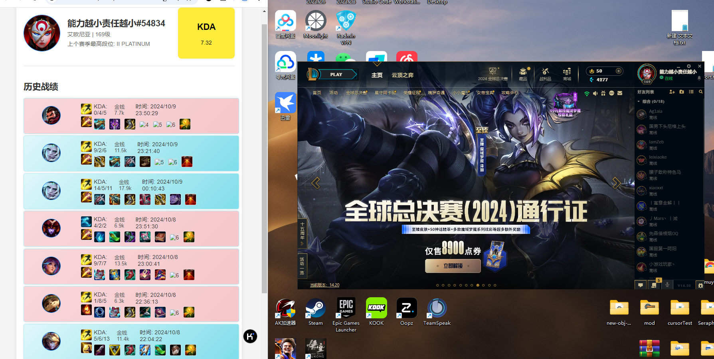
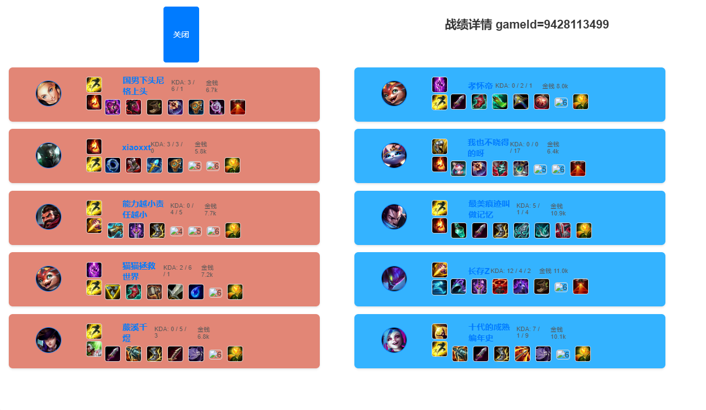

# lol-manager

*   英雄联盟助手,主要使用LCU API和SGP API,**未修改**客户端内容,**理论上不会封号!**,另外附上官方文档
*   [拳头文档](https://developer.riotgames.com/docs/lol/)
*   [lcu](https://hextechdocs.dev/tag/lcu/)
*   [版本英雄游戏数据](https://developer.riotgames.com/docs/lol#data-dragon_champions)
*   [CommunityDragon游戏资源](https://github.com/CommunityDragon/Docs/blob/master/assets.md)
*   [在线swagger](http://www.mingweisamuel.com/lcu-schema/tool/#/)
*   导出swagger V2:<https://127.0.0.1:2999/swagger/v2/swagger.json>
*   导出swagger V3:<https://127.0.0.1:2999/swagger/v3/openapi.json>

# 目前功能

查询战绩（包括隐藏战绩&#x20;

计算近十场kda（找大哥

~~进入对局时查询队伍两边战绩自动分析两边大哥（未完成~~
对局详情中点击战绩可以继续查询

